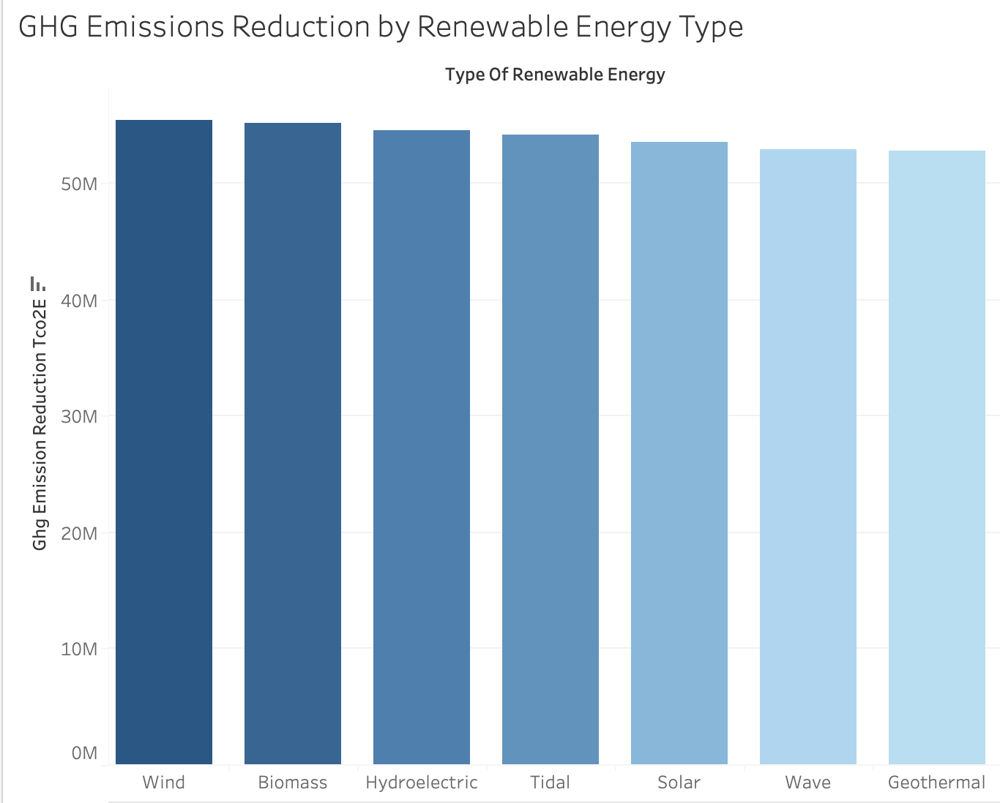
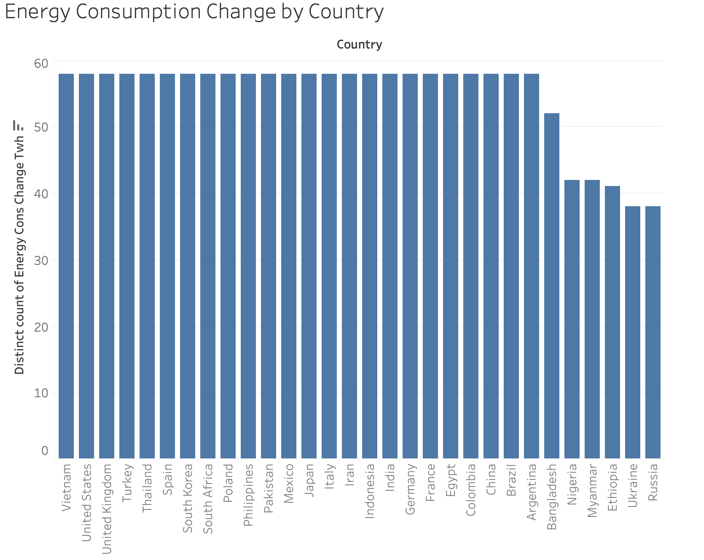
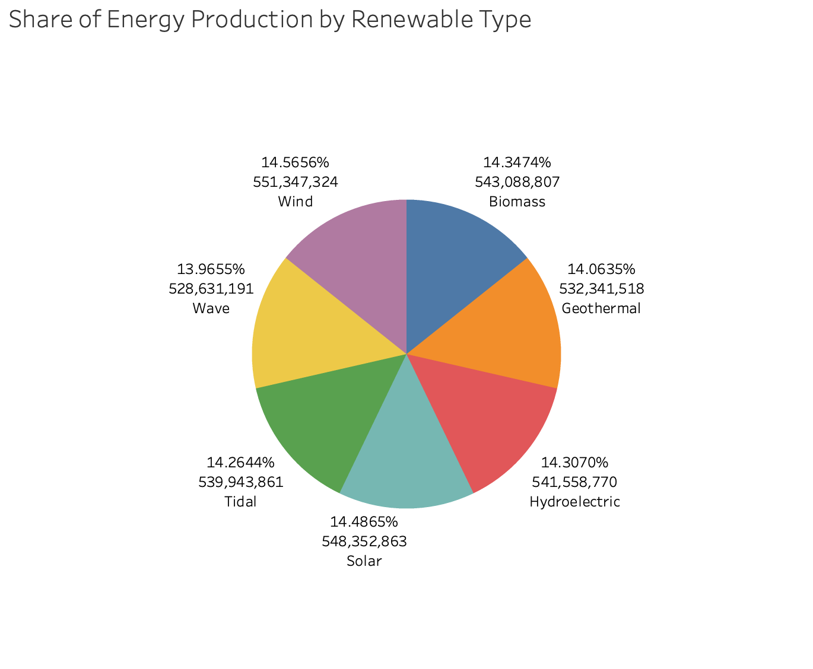
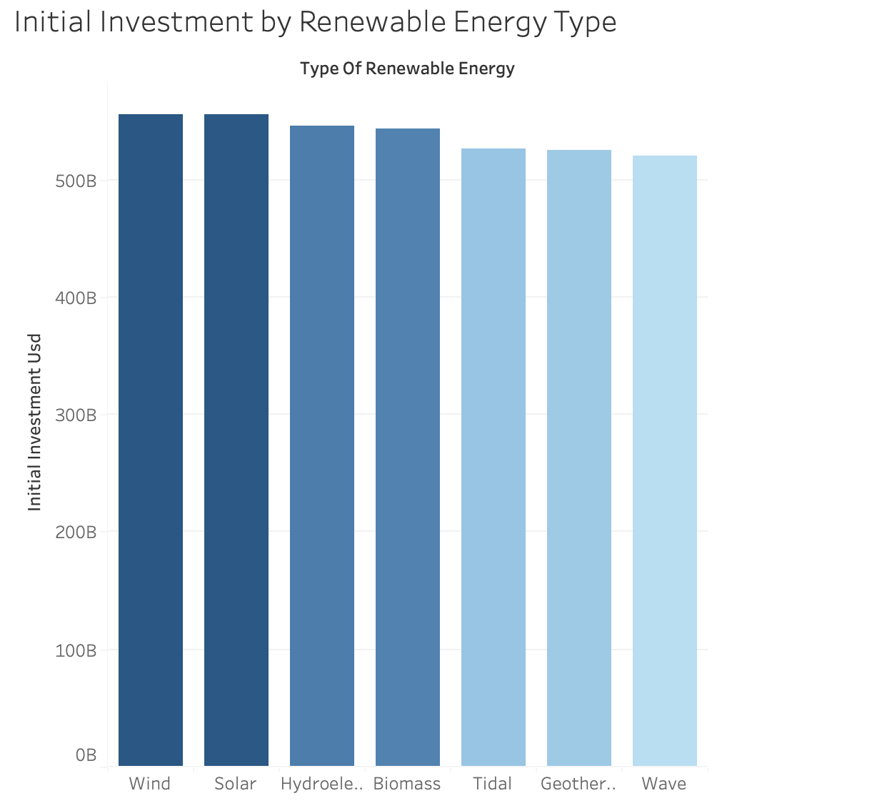
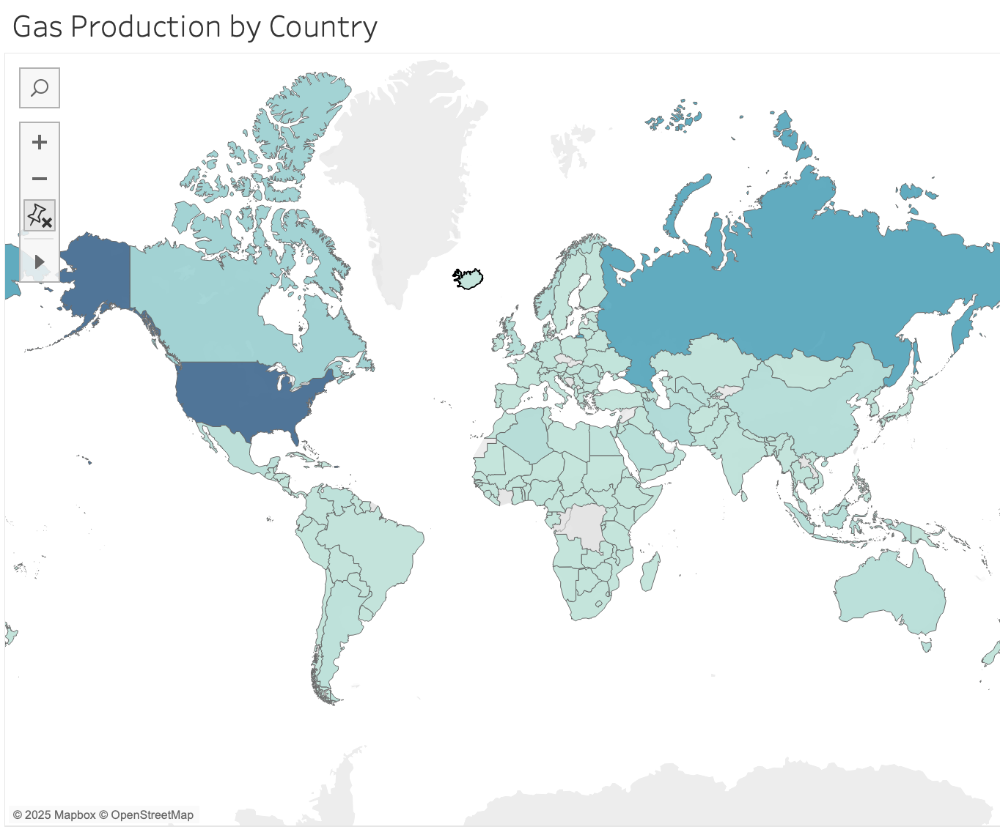
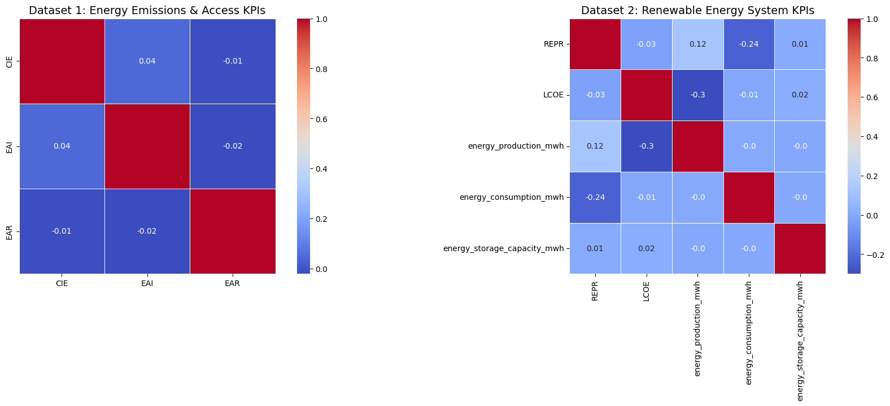
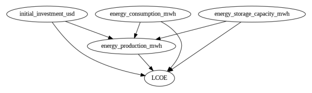

# Global Energy Sustainability Analysis Project
*A Decision Intelligence Approach to Understanding SDG 7*

## Executive Summary
This project analyzes global energy security through the lens of UN Sustainable Development Goal 7 (SDG 7). Using comprehensive datasets from international organizations, we aim to identify patterns, predict trends, and recommend interventions to improve energy access, affordability, and sustainability worldwide. Our analysis integrates traditional statistical methods with advanced machine learning techniques to uncover insights into energy production, carbon emissions, and consumer costs.

[Read detailed background information here](Background.md)

## Key Performance Indicators (KPIs)

1. **Carbon Intensity of Energy (CIE)**
   - Definition: Average CO₂ emissions per megawatt-hour (MWh) for each energy source.
   - Target: Reduce global average carbon intensity to below 100 kg CO₂/MWh by 2035.
   - Baseline: Current global average ~400 kg CO₂/MWh.
   - Monitoring: Annual assessment using national energy production and emissions data.

2. **Energy Affordability Index (EAI)**
   - Definition: Percentage of household income spent on electricity.
   - Target: Ensure energy costs remain below 5% of median household income in all regions.
   - Baseline: Varies by region; low-income households often exceed 10%.
   - Monitoring: Quarterly review based on consumer energy prices and income levels.

3. **Renewable Energy Penetration Rate (REPR)**
   - Definition: Percentage of total electricity generation sourced from renewables (solar, wind, hydro, geothermal).
   - Target: Increase renewable energy share to 60% of global electricity production by 2040.
   - Baseline: 29% as of 2023.
   - Monitoring: Annual review of national energy production statistics.

4. **Levelized Cost of Energy (LCOE) Benchmarking**
   - Definition: Comparison of LCOE (cost per MWh) across different energy sources, adjusted for subsidies and infrastructure costs.
   - Target: Reduce LCOE for renewables to below fossil fuel costs in all regions.
   - Baseline: Solar ($40/MWh), Wind ($35/MWh), Natural Gas ($60/MWh), Coal ($80/MWh).
   - Monitoring: Bi-annual cost analysis based on infrastructure investments and fuel prices.

5. **Energy Access Rate (EAR)**
   - Definition: Percentage of the population with reliable electricity access.
   - Target: 100% global electricity access by 2030.
   - Baseline: 90% as of 2023, with over 750 million people lacking access.
   - Monitoring: Annual tracking using World Bank and IEA data.

# Analysis

[Click to View Interactive Tableau Dashboard](https://public.tableau.com/app/profile/nick.kennedy3795/viz/Milestone2_17415650894380/Dashboard1?publish=yes)

### **1. GHG Emissions Reduction by Renewable Energy Type** *(CIE KPI)*

This visualization illustrates the greenhouse gas (GHG) emissions reduction achieved by each renewable energy type. Energy sources like Wind show significant potential for emissions reduction, highlighting their critical role in achieving sustainability targets. Lower-emission sources can guide strategic investments in cleaner energy infrastructures.

(attachment:e41d5c67-9097-4a01-8d6f-e0a56169cec6:Screenshot_2025-03-09_at_9.13.47_PM.png)

---

### **2. Energy Consumption Change by Country** *(EAI KPI)*

This chart displays how energy consumption has changed across various countries. Countries like Vietnam, United States, and United Kingdom show a sharp increase, indicating expanding energy access and affordability. Conversely, countries with low or declining consumption may highlight affordability challenges or limited access to reliable energy sources.

(attachment:caf5933d-3f9c-42a6-9eb8-2ed8dd06d5f4:Screenshot_2025-03-09_at_9.13.55_PM.png)

---

### **3. Share of Energy Production by Renewable Type** *(REPR KPI)*

This pie chart breaks down the share of total energy production by each renewable type. Wind dominates the energy mix, while other sources like Wave have smaller shares. This insight can inform policy focus and investment to encourage a more diversified and sustainable energy portfolio. 

(attachment:816e5d22-fbd2-4335-bbe5-4c804880f6ba:Screenshot_2025-03-09_at_9.14.01_PM.png)

---

### **4. Initial Investment by Renewable Energy Type** *(LCOE KPI)*

This chart showcases the initial investment required for each type of renewable energy. Wind demands the largest upfront investment, while Wave is relatively more affordable. Understanding these costs is crucial for making informed decisions on future energy projects.

(attachment:8536e39e-cca1-4813-b6a3-4eabcf2edd98:Screenshot_2025-03-09_at_9.14.18_PM.png)

---

### **5. Gas Production by Country** *(EAR KPI)*

This visualization presents total gas production by country, serving as an indirect indicator of energy access. Higher production in countries like United States suggests greater access and infrastructure development, whereas lower consumption in Belarus may indicate limited access or affordability constraints.

(attachment:6ebe9498-a904-4bc5-b389-d9ec0cdd97fe:Screenshot_2025-03-09_at_9.14.41_PM.png)

### Statistical Learning

Building on the initial visual exploration of energy KPIs and performance trends, we applied advanced statistical learning techniques to better understand the underlying relationships between the five core KPIs. These methods provide deeper insights into potential interdependencies and help inform data-driven recommendations for improving global energy sustainability.

### **Correlation Matrix Heatmap**

We first constructed two separate correlation matrices using Python to identify linear relationships between the KPIs. These heatmaps offer a high-level overview of which indicators tend to move together and may influence one another. Each matrix was based on a different dataset used in our analysis.

### **Correlation Matrix Insights**

---

Overall there was very little correlation between KPIs, it suggests they may be measuring different aspects of performance that don’t directly influence one another.

### **Dataset 1: Energy Emissions & Access KPIs**

1. **CIE and EAR**: Slight negative correlation (-0.01), suggesting countries with higher energy access may emit slightly less per unit of energy.
2. **CIE and EAI**: Weak positive correlation (+0.04), implying higher emissions may slightly increase energy affordability burdens.
3. **EAI and EAR**: Small negative correlation (-0.02), potentially indicating that broader access reduces energy cost burdens (though weakly).

**Key Observation:** There is **minimal correlation** among the emissions, affordability, and access KPIs—suggesting that external confounders may mask any direct effects.

### **Dataset 2: Renewable Energy System KPIs**

1. **REPR and energy_consumption_mwh**: Negative correlation (-0.24), indicating that countries with higher renewable penetration tend to consume less total energy.
2. **LCOE and energy_production_mwh**: Moderate **negative correlation (-0.30)**, suggesting larger production volumes are associated with lower energy costs.
3. **REPR and energy_production_mwh**: Mild positive correlation (+0.12), possibly reflecting the scalability of renewables.

**Key Observation:** The strongest pattern is the **inverse relationship between production and LCOE**, supporting economies of scale in renewable infrastructure.

---

Based on these observations, causal models were developed, tested, validated, and refined to better explore the causal relationships between KPIs. 

A Causal Inference model was created to further investigate this:

### Estimated Causal Effect of Energy Production Volume on Levelized Cost of Energy (LCOE)

A CausalModel was developed to analyze the effect of **energy production volume** on the **Levelized Cost of Energy (LCOE)**—a critical metric in evaluating the affordability and scalability of renewable energy systems. LCOE represents the per-unit cost of building and operating an energy-generating asset over its lifetime, making it essential for understanding how capital investment and infrastructure scale influence the cost of clean energy.

Among all the KPIs analyzed, energy production volume showed the strongest inverse correlation with LCOE, suggesting that as production scales, costs decline—potentially reflecting **economies of scale**. However, correlation alone does not imply causation, so a dedicated causal model was created to test whether increased energy production truly causes a reduction in LCOE.

The visual graph of the causal relationships—developed using ICA LiNGAM and refined using DoWhy—is shown below:

**CausalModel: Energy System KPIs**

The model found a **moderate negative causal effect**, with the estimated impact of increasing energy production on LCOE being approximately **-0.0268**. This means that for each unit increase in energy production (MWh), the LCOE decreases by about 0.027 units, holding other influencing variables constant. This result confirms that **increased energy production volume directly contributes to reducing the per-unit cost of renewable energy**.

To validate this result, the causal model was **refuted using two robust methods**: adding a random common cause and using a subset of the data. In both cases, the effect estimate remained nearly identical and statistically strong, with p-values of **0.94 and 0.92**, respectively—indicating a **high degree of confidence** in the model’s validity and reliability.

### **Conclusion**

This project has examined the state of global energy sustainability through the lens of **United Nations Sustainable Development Goal 7 (Affordable and Clean Energy)**. By leveraging open-source international datasets and applying a combination of visual analytics and advanced statistical learning techniques, we explored how global energy systems are influenced by a complex web of interconnected factors—ranging from carbon emissions and renewable energy production to affordability and accessibility.

We began by creating visual dashboards to showcase key performance indicators (KPIs) related to carbon intensity, energy affordability, renewable penetration, production costs, and energy access. These initial explorations highlighted important regional differences and provided insight into global energy disparities.

Building on this foundation, we applied correlation and causal inference techniques to uncover deeper patterns within the data. Our analysis revealed several critical findings:

- There is minimal correlation between emissions, affordability, and access KPIs—suggesting that they may be shaped more by external confounding variables than by direct interdependence.
- Within renewable energy systems, a **strong inverse relationship between energy production volume and LCOE** (Levelized Cost of Energy) was identified, indicating that **economies of scale are key** to reducing renewable energy costs.
- A dedicated causal model validated this finding, showing a statistically significant causal effect: **increasing energy production directly reduces LCOE**, with robust evidence across multiple refutation methods.

These insights underscore the importance of **scaling up renewable energy infrastructure** globally—not only to cut emissions, but also to make clean energy more affordable. However, persistent gaps in energy access and affordability highlight the ongoing need for targeted policy, investment, and innovation to ensure that the benefits of energy transition are equitably shared.

Ultimately, this project demonstrates how data-driven decision intelligence can support global progress toward **affordable, reliable, sustainable, and modern energy for all**.

